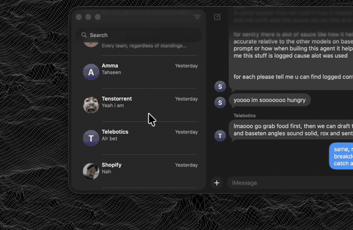
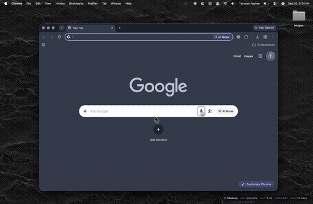
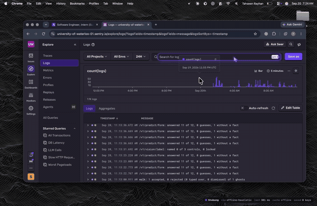
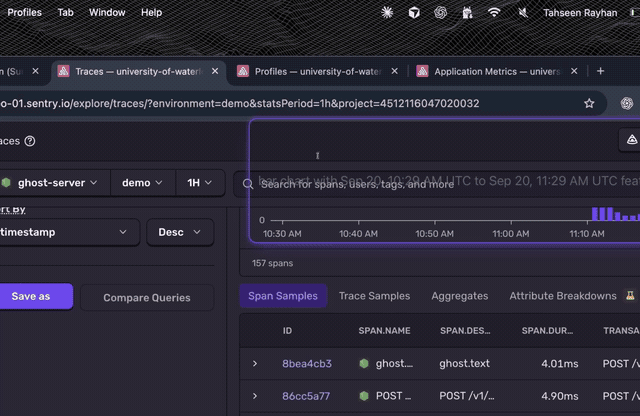
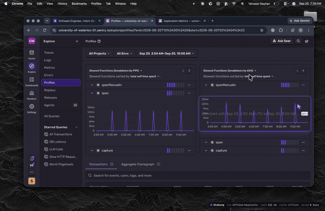
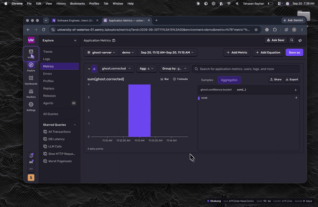
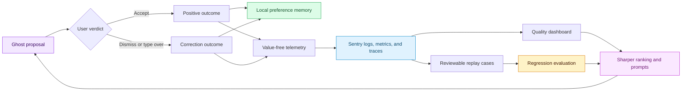
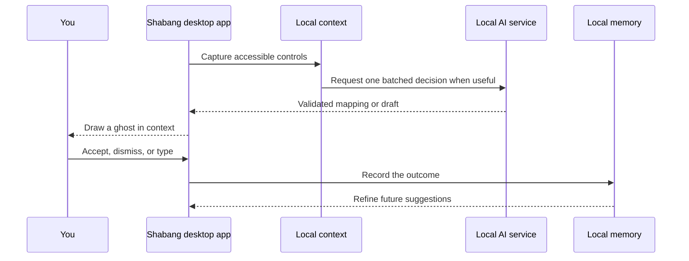

<div align="center">

# ✨ Shabang

### Your next action, already waiting for you.

**A native macOS AI agent that understands the screen in front of you, suggests the next useful step, and learns from every choice you make.**

<p>
  <a href="#watch-it-work">Watch demos</a> ·
  <a href="#how-the-agent-works">How it works</a> ·
  <a href="#run-it-locally">Run locally</a>
</p>

</div>

---

## The idea

Shabang brings a Cursor-like suggestion experience to your whole Mac. It reads the accessible controls in the app you are using, finds the strongest next action, and draws a subtle ghost directly where that action belongs.

| You are doing | Shabang helps with |
| --- | --- |
| Filling out an application | Matching fields with your saved profile and preparing answers |
| Replying to a message | Drafting a concise reply in the compose box |
| Navigating a busy app | Highlighting the next useful field or control |
| Repeating a familiar task | Adapting suggestions from your accepted choices |

Press **Tab** to take a visible focused-field suggestion. Use a lone **right Command** tap for other suggested controls. **Escape** clears a suggestion, and ordinary typing naturally takes over.

## Watch it work

Every preview below plays directly in GitHub. Select any preview to open its full MP4 walkthrough.

### Messages: draft a reply in place

[](Messages.mp4)

Shabang recognizes the conversation context, prepares a reply, and presents it right in the message composer.

### LinkedIn: move through a form with prepared answers

[](Linkedin.mp4)

A single batched AI decision maps the form to the profile facts Shabang already knows, so the next fields are ready as you move through them.

### OpenTable: a fast, focused interaction

[](OpenTable_Fast.mp4)

The ghost follows the current task, turning a multi-step interaction into a clear sequence of suggestions.

### The learning loop in Sentry

<table>
  <tr>
    <td width="50%" valign="top">
      <strong>Logs</strong><br><br>
      <a href="Sentry%20Logs.mp4"></a>
    </td>
    <td width="50%" valign="top">
      <strong>Traces</strong><br><br>
      <a href="Sentry%20Traces.mp4"></a>
    </td>
  </tr>
  <tr>
    <td width="50%" valign="top">
      <strong>Profiles</strong><br><br>
      <a href="Sentry%20Profiles.mp4"></a>
    </td>
    <td width="50%" valign="top">
      <strong>App metrics</strong><br><br>
      <a href="Sentry%20App%20Metrics.mp4"></a>
    </td>
  </tr>
</table>

These views make the agent loop visible: each outcome becomes a value-free product signal that helps the team measure suggestion quality, speed, and learning over time.

## Sentry turns feedback into agent improvement

Every ghost is a small prediction. The person's response is the answer key. That creates a feedback loop that feels like training data, with no extra annotation work: accepting a ghost is a positive signal, while dismissing or typing over it is a clear correction signal.



### What Shabang records

For every proposal, Shabang records a compact event with the **action class**, **suggestion source**, **provider**, **calibration flag**, **confidence bucket**, **latency bucket**, and the person's **verdict**. The payload uses closed categories and coarse counts, creating a durable, privacy-preserving feedback stream.

`ghost.proposed` is counted for every suggestion. Shabang then records `ghost.accepted`, `ghost.corrected`, `ghost.dismissed`, or `ghost.skipped`, all tagged with `ghost.class`, `ghost.source`, `ghost.confidence.bucket`, and `ghost.surface`. That makes an acceptance rate, correction rate, and decision-time distribution immediately explorable in Sentry.

### How that makes the agent better

The loop runs at two speeds:

1. **Personal learning, immediately.** Each verdict refines local answer and action memory, so the next suggestion better reflects that person's habits.
2. **Product learning, continuously.** Sentry shows how suggestion quality changes by source, class, confidence, and surface. A calibrated high-confidence ghost that gets dismissed or typed over becomes a reviewable replay case. Reviewed cases feed `pnpm eval:walk-replays`, giving the team a living regression suite for improving ranking, prompts, and confidence behavior.

This is training-like feedback with the user supplying the ground truth through natural interaction. It keeps the experience personal in the moment and makes the agent stronger through a measurable evaluation loop over time.

## How the agent works

Shabang keeps the interaction simple for the person using it while coordinating several focused layers behind the scenes.

```mermaid
flowchart LR
    A[Frontmost macOS app] --> B[Accessibility capture]
    B --> C[Local context and safety filter]
    C --> D[Rank likely next action]
    D --> E[Ghost overlay]
    E --> F{Your choice}
    F -->|Accept| G[Verified write or focused action]
    F -->|Dismiss or replace| H[Record outcome]
    G --> H
    H --> I[Local preference memory]
    H --> K[Value-free outcome telemetry]
    K --> L[Sentry learning analytics]

    C -. optional form mapping or text draft .-> J[Loopback AI service]
    J -. validated suggestion .-> D

    style A fill:#e8f0fe,stroke:#2563eb,color:#172554
    style E fill:#f3e8ff,stroke:#9333ea,color:#3b0764
    style F fill:#fef3c7,stroke:#d97706,color:#451a03
    style I fill:#dcfce7,stroke:#16a34a,color:#14532d
    style J fill:#e0f2fe,stroke:#0284c7,color:#0c4a6e
    style L fill:#fef3c7,stroke:#d97706,color:#451a03
```



### 1. Understand the current screen

The desktop app reads the accessibility tree of the frontmost macOS app and turns eligible controls into structured context: fields, labels, roles, and nearby interaction cues.

### 2. Choose the best suggestion

The local ranking engine combines screen context, profile facts, learned preferences, and app-agnostic affordance roles. For a form, the optional local AI service makes one batched mapping decision. For a writing surface, it can stream a draft into the ghost.

### 3. Keep you in control

Shabang displays a suggestion in place and waits for your explicit input. It performs the narrowest supported write and verifies the result. Sensitive fields and high-impact actions remain thoughtfully guarded.

### 4. Learn from the outcome

Accepting, dismissing, or replacing a ghost creates a compact outcome signal. Local memory uses that signal to make future suggestions feel more personal, while Sentry reveals the aggregate patterns that become replay evaluations and future product improvements.

## Built for a fast loop



The fast local path is always ready. AI adds focused form decisions and writing assistance through a loopback service at `127.0.0.1`, keeping provider credentials out of the desktop app.

## What powers Shabang

| Layer | Role |
| --- | --- |
| **Native desktop app** | Menu-bar experience, Accessibility capture, ghost rendering, keyboard interaction, and verified writes |
| **Shared TypeScript brain** | Field handling, local ranking, profile resolution, affordance roles, and preference memory |
| **Local Node.js service** | Batched form predictions, streamed text drafts, telemetry, and provider access |
| **TypeSafe Jev** | Typed, confidence-aware decisions for mapping form fields to profile facts |
| **Baseten** | Streaming text drafts and a flexible decision-provider path |
| **Sentry** | Logs, traces, metrics, profiles, and session replay for the agent learning loop |

## Run it locally

### What you need

- macOS 13 or later
- Node.js 22 or later
- pnpm 10 or later
- Xcode Command Line Tools
- Accessibility permission for Shabang

### Start the development experience

```bash
pnpm install
pnpm --filter @shabang/server dev
```

In a second terminal:

```bash
make -C desktop run
```

At first launch, enable **Shabang** in **System Settings → Privacy & Security → Accessibility**. The app appears in your menu bar once it is running.

### One-command install

```bash
./install.sh
```

The installer prepares dependencies, builds Shabang, places the app in `~/Applications`, guides the Accessibility setup, and verifies the installation. Use `./install.sh --check` for a read-only environment check or `./install.sh --update` after changing code.

### Useful checks

```bash
pnpm typecheck
pnpm test
pnpm desktop:test
pnpm test:terminal
```

## Explore the project

| Where to look | What you will find |
| --- | --- |
| [desktop/](desktop/README.md) | Native macOS app, setup, interaction model, and desktop commands |
| [shared/](shared/) | Core ranking, knowledge, form, and safety logic |
| [server/](server/) | Loopback service, providers, and observability integration |
| [demo/](demo/) | Local fictional surfaces for developing and rehearsing interactions |
| [terminal/](terminal/README.md) | Optional zsh command suggestion companion |
| [docs/](docs/README.md) | Architecture, data handling, learning loop, and technical notes |
| [SENTRY.md](SENTRY.md) | Observability story and live demo guide |

## A few details that matter

- **Local-first:** contextual ranking and preference memory live on the Mac.
- **App-agnostic:** Shabang works from accessible roles and labels rather than per-site scripts.
- **One decision, many fields:** a form is mapped in one batched request, then suggestions are ready as you move through it.
- **Purpose-built AI:** typed decisions choose the right fact, while a text model writes the right words.
- **Visible learning:** accepted and dismissed suggestions provide the feedback signal that makes the agent sharper over time.

<div align="center">

Built at Hack the North 2026 · **Shabang makes the next step feel obvious.**

</div>
